<style>
section { 
    font-size: 20px; 
    /* background-color: #161f36; */
    background-color: #F5F5DC;
    font-family: 'Times New Roman';
    color:#000000;
}
img[alt~="center"] {
  display: block;
  margin: 0 auto;
}
</style>

<style scoped>section { font-size: 30px; }</style>

<!-- footer: 'Haytam EL MERABETI | M.Eng. HPDA Student @CY Tech | M.Sc. HPC Student @University of A Coruña | https://github.com/H4yt4m/Master-Thesis-Project | 2023' -->
<!-- 
_paginate: false
 -->

# Hyperspectral Image Segmentation Using Quantum Annealing


<p align="center"></p>


---
<!-- _footer: "" -->
# Student

### Haytam El Merabeti

M.Eng. High Performance Data Analytics HPDA
CY Tech

M.Sc. High Performance Computing HPC
University of A Coruña

elmerabeti@cy-tech.fr

---

# Supervisors 

<div class="grid grid-cols-2 gap-4">
<div>

### Gabriele Cavallaro

Head of Simulation and Data Lab
Jülich Supercomputing Centre

g.cavallaro@fz-juelich.de

Adjunct Associate Professor
University of Iceland

gcavallaro@hi.is

</div>
<div>

### Piotr Gawron

Scientific Computing & Information Technology Group Leader
AstroCeNT: Particle Astrophysics Science and Technology Centre
International Research Agenda,
Nicolaus Copernicus Astronomical Centre

gawron@camk.edu.pl

</div>
</div>

---

# Classical Computing vs Quantum Computing 

--- 

<!-- # Unit of information

_footer: "https://azure.microsoft.com/en-us/resources/cloud-computing-dictionary/what-is-a-qubit/#introduction"


--- -->

# Unit of information

<div class="grid grid-cols-2 gap-2">
<div>

### Bits

- Binary

- Deterministic

- Relatively stable

- Boolean logic 
$\rightarrow$ Logic Gates

</div>
<div>

### Qubits

- Superposition

- Entanglement

- Decoherence / Extreme sensitivity

- Quantum measurement 
$\rightarrow$ Quantum Gates

</div>
</div>

---

# Advantages & Limits

<div class="grid grid-cols-2 gap-2">
<div>

#### Classical Computing

- **Advantages** : 
    - Reliability
    - Accuracy
    - Cost-effectiveness
- **Limits** : 
    - Transistor density in Integrated Circuits (IC) 
    $\rightarrow$ Moore’s law
    - Exponential time complexity
    $\rightarrow$ NP-Hard problems
    - Simulation of large-scale quantum systems
    $\rightarrow$ Richard Feynman : "Nature isn't classical" 

</div>
<div>

#### Quantum Computing

- **Advantages** : 
    - Exponential speedup for certain problems
    $\rightarrow$ Shor's algorithm, Grover's algorithm
    - Large-scale memory capacity
    $\rightarrow$ Superposition of states represents large number of values simultaneously
    - Efficient simulation of real-world systems
    $\rightarrow$ Based on Quantum Mechanics

- **Limits** : 
    - Decoherence
    - Error correction
    - Scalability

</div>
</div>


---

# Quantum Annealers

<div class="grid grid-cols-2 gap-2">
<div>

### Quantum

- Qubits

- Superposition
- Entanglement
- Interference


</div>
<div>

### Annealing

- Probabilistic

- Randomness
- Exploration vs Exploitation
- Temperature schedule


</div>
</div>

---

# Hyperspectral Image Segmentation 
# Using Quantum Annealing

---

# Indian Pines Dataset

<div class="grid grid-cols-3 gap-5">
<div>

&nbsp; 
&nbsp; 
 

- 145*145 pixels.

- 200 spectral reflectance bands (for the corrected version).

- Wavelength range :
 400nm - 2500nm.

- One-vs-Rest Classification Algorithm.


</div>

<div>

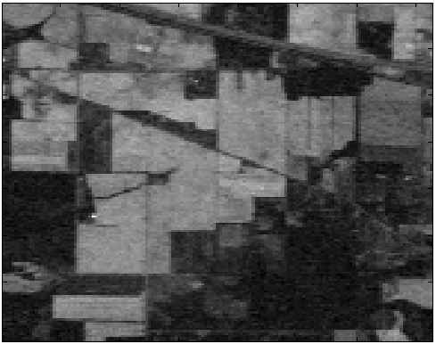

Indian pines Dataset : Sample

</div>
<div>

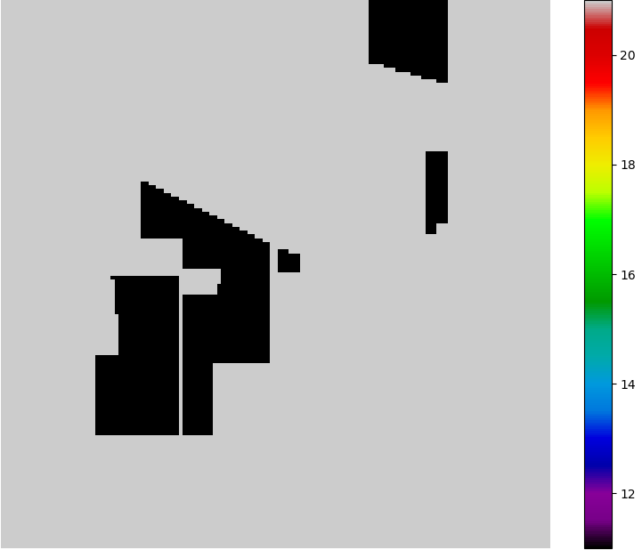

Ground state : Target Class N°11

</div>
</div>

<!-- _footer: "https://www.ehu.eus/ccwintco/index.php?title=Hyperspectral_Remote_Sensing_Scenes#Indian_Pines" -->


---

# Step 1
### Choose a Classifier 

---

# Support Vector Machine SVM

<div class="grid grid-cols-2 gap-2">
<div>

### $f(x) = w^Tx + b$

Given training data $(x_i, y_i)$ for $i=1...N$, with $x_i \in \reals^d$ and $y_i \in \{-1, 1\}$,
learn a classifier $f(x)$ such that :

$f(x_i) = \left\{
    \begin{array}{ll}
        \ge 0 \space if \space y_i=+1\\
        \lt 0 \space if \space y_i=-1
    \end{array}
\right.$

i.e. $y_if(x_i) > 0$ for a correct classification.

#### Trade off between the margin and the number of mistakes on the training data !

</div>
<div>

<!-- _footer: "https://www.robots.ox.ac.uk/~az/lectures/ml/lect2.pdf" -->

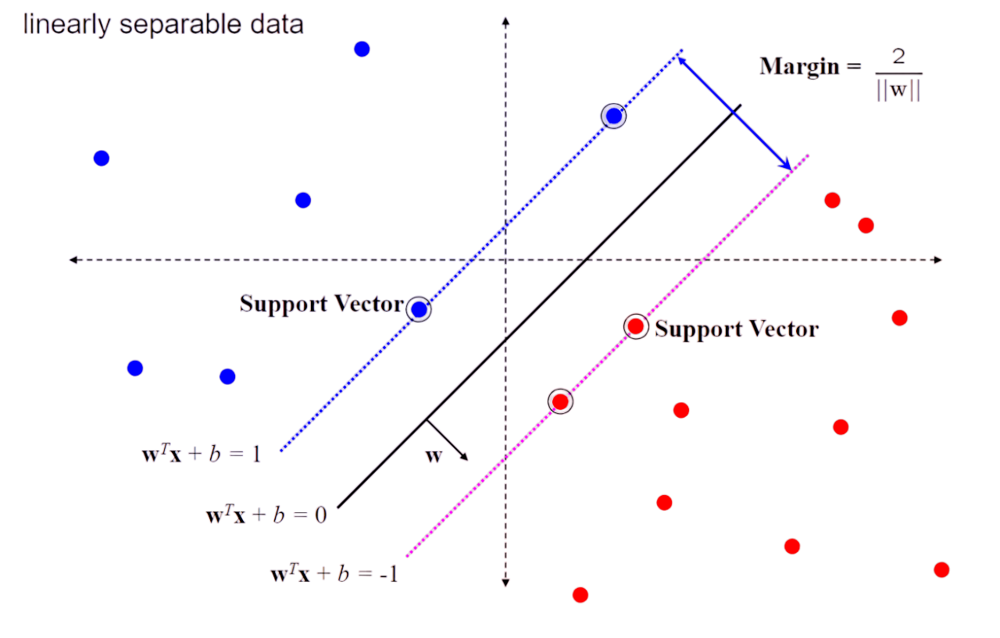


</div>
</div>

<!-- ---

<div class="grid grid-cols-2 gap-1">
<div>
&nbsp; 
&nbsp; 

# Result
&nbsp; 
&nbsp; 

- Ground Truth

</div>
<div>


</div>
</div> -->

---

<div class="grid grid-cols-2 gap-1">
<div>
&nbsp; 
&nbsp; 

# Result
&nbsp; 
&nbsp; 

- SVM.

- Parameters (GridSearchCV): 
```python
SVC(C=100, cache_size=1024, kernel="poly", probability=True)
```


</div>
<div>

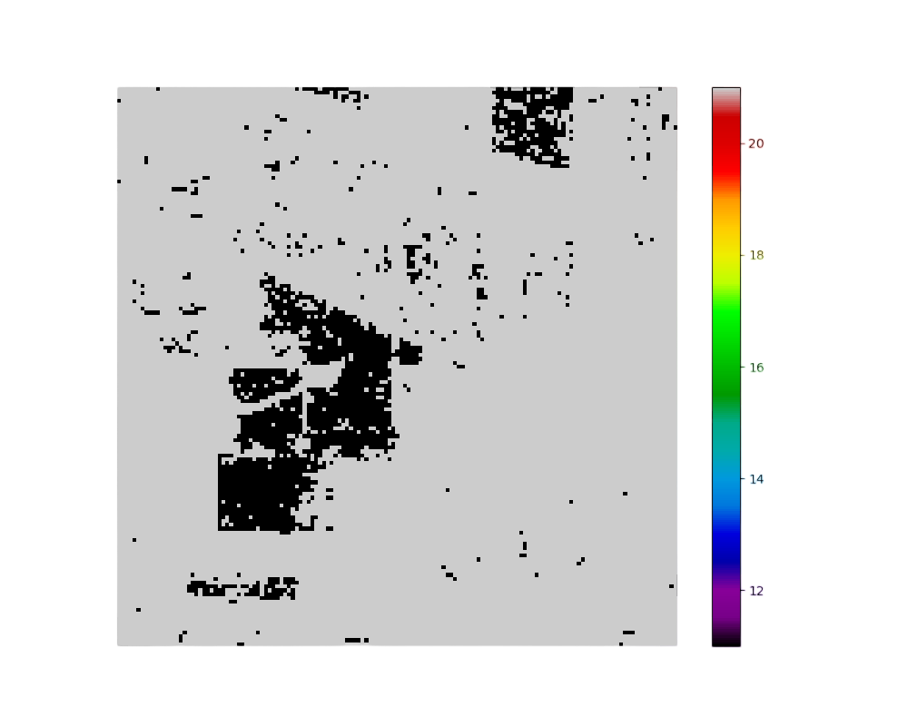

</div>
</div>

---

# Step 2
### Construct the adapted model for the problem formulation

---

# Markov Random Fields

<div class="grid grid-cols-2 gap-2">
<div>

- Undirected graph $G = (V, E)$.
- Nodes V : 
    $\rightarrow$ Discrete or Gaussian Probability distribution of Random Variables RV : ${\{u_j\}}_{j\in V}$.
- Edges E : 
    $\rightarrow$ Binary edges.
    $\rightarrow$ Strength of the dependence between both variables.
- Given $N_i$ Markov blanket of Node i (Neighborhood) : $\forall i \in {1, 2, ..., N}:$ 
    $p(u_i | \{u_j \}_{j∈V-i}) = p(u_i | \{u_j \}_{j∈N_i} )$ 
- Energy expression : 

$E(u) = E_{data}(u) + E_{smoothness}(u)$
</div>
<div>

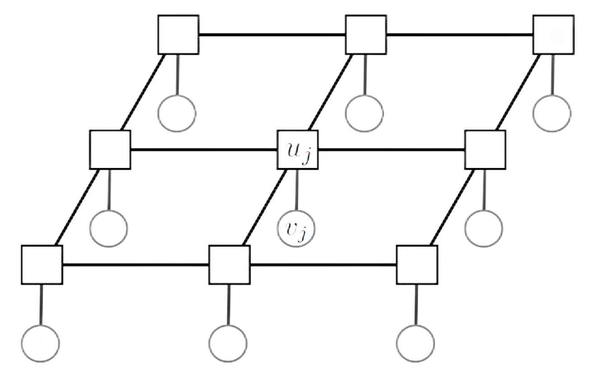

</div>
</div>

---

# Ising model

<div class="grid grid-cols-2 gap-2">
<div>

- Originated from Statistical Physics (Ferromagnetism).

- Hamiltonian : 
$\rightarrow H(s)=-\sum_ih_i*s_i-\beta\sum_{i\sim j}s_i*s_j$

- Parameters :
    - $s$ : Spin configuration.
    - $s_i$ : Pixel index $i$ of the image (as a 1D vector).
    - $h_i$ : Likelihood / Energy of being in a particular class.
        $\rightarrow h_i = −1/4 log(1/Pi(c)−1)$ 
    - $\beta$ : How strongly its neighbors wants it to be in their class (magnetic moment).
        $\rightarrow \beta = 1$

</div>
<div>
<!-- --- -->
<!-- _footer: "" -->

<!-- ### Two-dimensional square-lattice -->

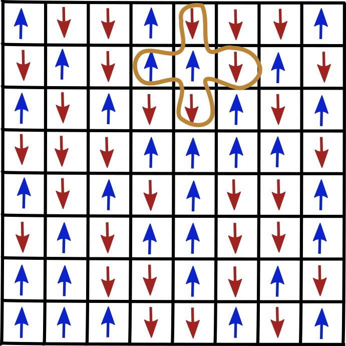

<!-- _footer: "https://astro.pas.rochester.edu/~aquillen/phy256/problems/ps8.html" -->

</div>
</div>

---
<div class="grid grid-cols-2 gap-1">
<div>
&nbsp; 
&nbsp; 

# Result
&nbsp; 
&nbsp; 

- Classical Simulated Annealing.

- Metropolis-Hastings algorithm: 

    - State transition probability : $e^{-\delta E/T}$

- Parameters:

    - temperature: 4 $\rightarrow$ 0.5

    - beta: 0.5

</div>
<div>

&nbsp; 
&nbsp; 

<video controls = "controls" height=70% src="run_dynamic_temp_4_0,5_beta_0,5.mp4">
</video>

</div>
</div>

---

# Step 3
### Embed the model into the Quantum Annealer

---

# Embedding

<div class="grid grid-cols-4 gap-2">

<div>

Host graph


</div>

<div>

Problem graph


</div>

<div>

Embedding N°1

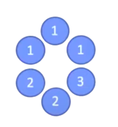

</div>

<div>

Embedding N°2

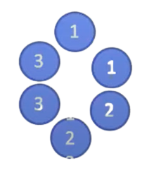

</div>

</div>

---
<spacer type="horizontal" width="100" height="100"></spacer>

# Chimera Graph 

<div class="grid grid-cols-2 gap-2">
<div>

<spacer type="horizontal" width="100" height="100"></spacer>
<spacer type="horizontal" width="100" height="100"></spacer>
<spacer type="horizontal" width="100" height="100"></spacer>
<spacer type="horizontal" width="100" height="100"></spacer>


<!-- - $(𝑀,𝐿)$ Chimera graph.
- $2∗𝑀∗𝑀∗𝐿$ nodes (qubits).
- Maximal degree of a given node is 6. 
- $𝑀∗𝑀$ cells (or subgraphs) in the grid. 
- $2L$ nodes per subgraphs, organized as bipartite. -->

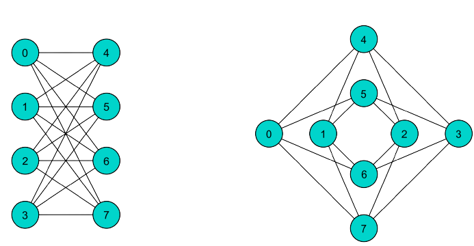

<!-- _footer: "https://arxiv.org/pdf/1407.2887.pdf" -->

</div>
<div>

### 

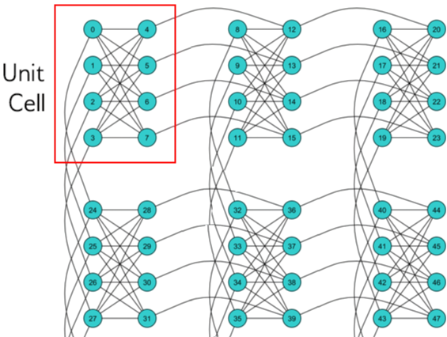

</div>
</div>

<!-- _footer: "https://docs.ocean.dwavesys.com/en/stable/concepts/topology.html" -->

---
<spacer type="horizontal" width="100" height="100"></spacer>
<spacer type="horizontal" width="100" height="100"></spacer>

# Pegasus Graph 

<div class="grid grid-cols-2 gap-2">
<div>

<spacer type="horizontal" width="100" height="100"></spacer>
<spacer type="horizontal" width="100" height="100"></spacer>
<spacer type="horizontal" width="100" height="100"></spacer>
<spacer type="horizontal" width="100" height="100"></spacer>


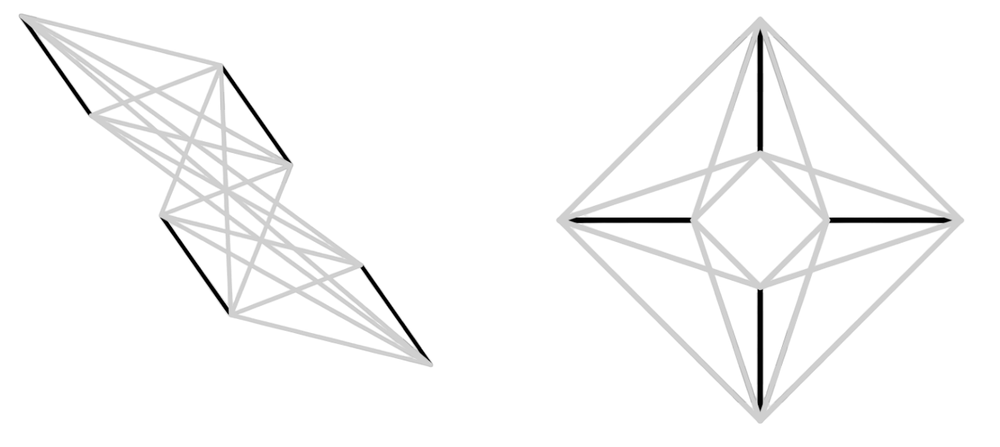

</div>
<div>

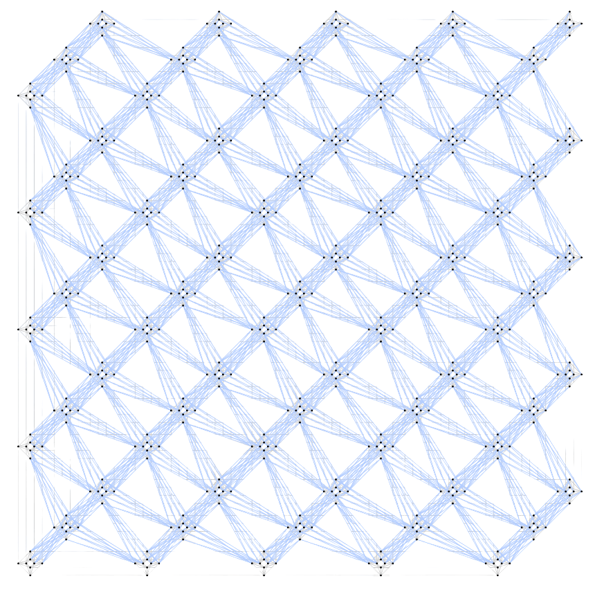

</div>
</div>

<!-- _footer: "https://www.semanticscholar.org/paper/Pegasus%3A-The-second-connectivity-graph-for-quantum-Dattani-Szalay/16d0b6f7b4822a5093b1c204fe258d9ac2fd7820" -->

<!-- ---

# Result -->

---

<div class="grid grid-cols-2 gap-1">
<div>

# Result
&nbsp; 
&nbsp; 

- Quantum Annealing 
    
    - Patches: 16 * (47, 47, 2)

    - Default "minorminer" embedding algorithm.

- Parameters :

    - beta: 0.5

    - num_reads: 100


</div>
<div>

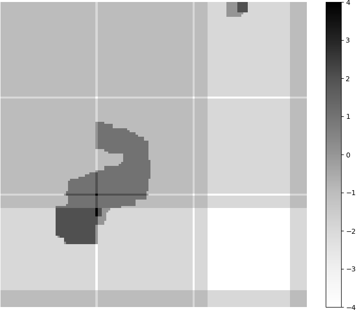

</div>
</div>

--- 
### Thank you!

---

# Appendix

---

# One-vs-Rest Classification Algorithm

1. Normalize the data.

2. For each class $c∈C$ :
2.1 Split $X_{train}$ into classes: c, ¬c (not c).
2.2 Train a binary SVM using $X_{train}$ and $y_{train}$.
2.3 Calculate probabilities $P_i(c)$, $P_i(¬c)$ of i-th pixel from $X$ having/not having class c.
2.4 Calculate **local energy**: $h_i = −1/4 log(1/Pi(c)−1)$.
2.5 Build **Ising model**: $H(s)=−∑_ih_i*s_i − β*∑_{i∼j}s_i*s_j$.
2.6 Embed grid model into **chimera graph**.
2.7 Sample K = 10 low energy states samples using DWave annealer. 
2.8 Unembed the model back to grid. 
2.9 For each pixel i: $P^′_i(c) = ∑^K_{k=1}\frac{1}{∑^K_{ξ=1} exp(−H(s^{[ξ]}) + H(s^{[k]}))} ×δ(s^{[k]}_i = 1)$, where $s^{[k]}$ is a configuration and $H(s^{[k]})$ is energy of sample k. 

3. For each pixel $i$ assign class $c^*_i$: $c^*_i=argmax_{c∈C}P′_i(c)$.

<!-- _footer: "https://www.researchgate.net/publication/367340565_Hyper-spectral_Image_Classification_using_Adiabatic_Quantum_Computation" -->

